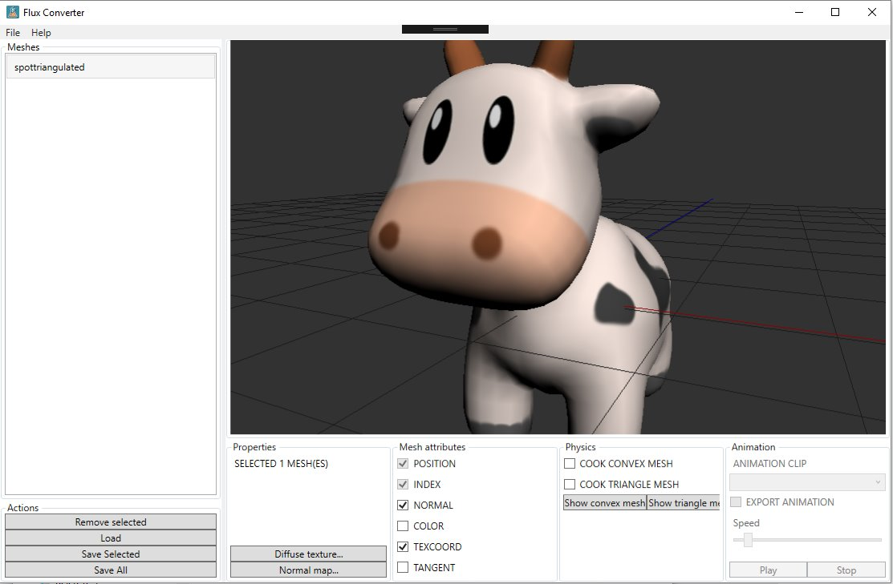

# FluxConverter

WPF tool using Assimp to load meshes and view them.
This tool converts various mesh type into my own .flux binary format for faster loading in FluxEngine

This required making a C# wrapper for the physics mesh cooking part of Nvidia PhysX.

## External Packages
* MahApps Metro
* MvvmLight
* SharpDX
* Newtonsoft Json
* AssimpNet
* Nvidia PhysX